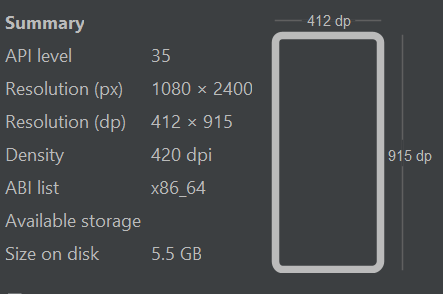

# IphoneCalculator

## Intro
This is a mini version of vertical iphone calculator. (There is also horizontal, extended version but I haven't included this option in my project)


## Deployment 
APK


## Technologies Used
Kotlin (jetpack compose)

## Installation and Setup 
#### "C:\Users\newzn\Projects\IphoneCalculator\app\src\main\java\com\example\iphonecalculator\MainActivity.kt" - path to main file
#### "class MainActivity" - the main class in that file which loads the app
```bash
git clone git@github.com:nikitazuevblago/IphoneCalculator.git
```
shift+f10 (Android Studio)

## Possible problems 
The app is adapted only for certain resolution.

